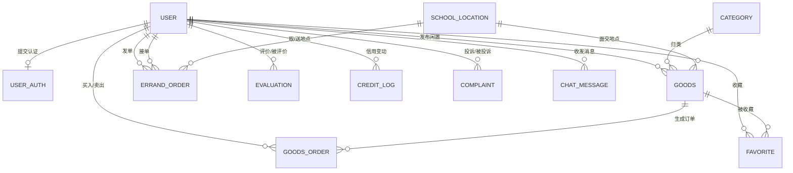

# 校园集市 · 数据库设计文档

> 版本：v1.0　　数据库：MySQL 8.0　　引擎：InnoDB　　字符集：utf8mb4

---

## 1. 设计总则

- **命名规范**：表名小写单数下划线分隔，字段小写下划线，主键统一 `id`，外键以 `_id` 结尾。
- **通用字段**：所有业务表包含 `create_time`、`update_time`；核心表使用逻辑删除 `is_deleted`（0 正常 / 1 已删），不做物理删除，便于追溯与答辩时讲"数据安全设计"。
- **金额字段**：一律 `DECIMAL(10,2)`，禁止用 FLOAT/DOUBLE（精度问题，评委必问）。
- **状态字段**：一律 `TINYINT` + 代码枚举，含义在本文档中登记，后端用枚举类映射。
- **敏感字段**：密码 BCrypt 加密存储；取件码加密存储，仅接单后对接单人可见。

---

## 2. 全局 ER 图

---

## 3. 表结构明细

### 3.1 user 用户表

| 字段 | 类型 | 空 | 默认 | 说明 |
|---|---|---|---|---|
| id | BIGINT UNSIGNED | NO | AUTO_INCREMENT | 主键 |
| phone | VARCHAR(11) | NO | - | 手机号，**唯一索引** |
| password | VARCHAR(64) | NO | - | BCrypt 加密后的密码 |
| nickname | VARCHAR(32) | NO | '校园用户' | 昵称 |
| avatar | VARCHAR(255) | YES | NULL | 头像 URL |
| gender | TINYINT | NO | 0 | 0未知 1男 2女 |
| auth_status | TINYINT | NO | 0 | 认证状态：0未认证 1审核中 2已认证 3已驳回 |
| is_runner | TINYINT | NO | 0 | 是否跑男：0否 1是（需二次认证） |
| credit_score | INT | NO | 100 | 信用分，满分100，低于60限制发布 |
| status | TINYINT | NO | 0 | 账号状态：0正常 1封禁 |
| last_login_time | DATETIME | YES | NULL | 最近登录时间 |
| create_time | DATETIME | NO | CURRENT_TIMESTAMP | 注册时间 |
| update_time | DATETIME | NO | CURRENT_TIMESTAMP ON UPDATE | 更新时间 |

**索引**：`uk_phone(phone)`、`idx_credit(credit_score)`

---

### 3.2 user_auth 校园认证表

| 字段 | 类型 | 空 | 默认 | 说明 |
|---|---|---|---|---|
| id | BIGINT UNSIGNED | NO | AUTO_INCREMENT | 主键 |
| user_id | BIGINT UNSIGNED | NO | - | 关联用户，普通索引 |
| student_no | VARCHAR(20) | NO | - | 学号，**唯一索引**（一个学号只能认证一个账号） |
| real_name | VARCHAR(16) | NO | - | 真实姓名 |
| college | VARCHAR(32) | YES | NULL | 学院/系 |
| grade | VARCHAR(16) | YES | NULL | 年级班级 |
| dorm_building | VARCHAR(32) | YES | NULL | 宿舍楼（用于同楼推荐） |
| material_url | VARCHAR(255) | NO | - | 认证材料图片（校园卡/教务截图） |
| audit_status | TINYINT | NO | 0 | 0待审核 1通过 2驳回 |
| audit_remark | VARCHAR(255) | YES | NULL | 驳回原因 |
| auditor_id | BIGINT UNSIGNED | YES | NULL | 审核管理员 |
| audit_time | DATETIME | YES | NULL | 审核时间 |
| create_time | DATETIME | NO | CURRENT_TIMESTAMP | 提交时间 |
| update_time | DATETIME | NO | - | 更新时间 |

**设计要点**：与 user 表分离——用户可多次提交认证（驳回后重提），历史材料留痕。

---

### 3.3 category 分类表

| 字段 | 类型 | 空 | 默认 | 说明 |
|---|---|---|---|---|
| id | INT UNSIGNED | NO | AUTO_INCREMENT | 主键 |
| name | VARCHAR(16) | NO | - | 分类名（教材/数码/服饰/生活/取快递/代买餐…） |
| icon | VARCHAR(255) | YES | NULL | 图标 URL |
| type | TINYINT | NO | 1 | 1闲置分类 2跑腿类型 |
| sort | INT | NO | 0 | 排序，越小越靠前 |
| status | TINYINT | NO | 1 | 1启用 0停用 |

---

### 3.4 goods 闲置商品表

| 字段 | 类型 | 空 | 默认 | 说明 |
|---|---|---|---|---|
| id | BIGINT UNSIGNED | NO | AUTO_INCREMENT | 主键 |
| user_id | BIGINT UNSIGNED | NO | - | 卖家，普通索引 |
| title | VARCHAR(64) | NO | - | 商品标题 |
| category_id | INT UNSIGNED | NO | - | 分类 |
| price | DECIMAL(10,2) | NO | - | 售价 |
| original_price | DECIMAL(10,2) | YES | NULL | 原价（展示"几折"用） |
| quality | TINYINT | NO | 3 | 新旧：1全新 2九成新 3八成新 4有明显使用痕迹 |
| description | TEXT | YES | NULL | 商品描述 |
| images | JSON | YES | NULL | 图片URL数组，最多9张 |
| location_id | INT UNSIGNED | YES | NULL | 期望面交地点 → school_location |
| status | TINYINT | NO | 1 | 0审核中 1在售 2已售出 3卖家下架 4违规下架 |
| view_count | INT UNSIGNED | NO | 0 | 浏览数 |
| fav_count | INT UNSIGNED | NO | 0 | 收藏数 |
| want_count | INT UNSIGNED | NO | 0 | "我想要"次数 |
| is_deleted | TINYINT | NO | 0 | 逻辑删除 |
| create_time | DATETIME | NO | CURRENT_TIMESTAMP | 发布时间 |
| update_time | DATETIME | NO | - | 更新时间 |

**索引**：`idx_status_category(status, category_id)`（列表查询高频）、`idx_user(user_id)`、`FULLTEXT(title, description)`（搜索，量大后再迁 Elasticsearch）

---

### 3.5 goods_order 闲置交易订单表

| 字段 | 类型 | 空 | 默认 | 说明 |
|---|---|---|---|---|
| id | BIGINT UNSIGNED | NO | AUTO_INCREMENT | 主键 |
| order_no | VARCHAR(32) | NO | - | 订单号，**唯一索引**（规则：日期+用户id+随机数） |
| goods_id | BIGINT UNSIGNED | NO | - | 商品 |
| buyer_id | BIGINT UNSIGNED | NO | - | 买家，普通索引 |
| seller_id | BIGINT UNSIGNED | NO | - | 卖家，普通索引 |
| deal_price | DECIMAL(10,2) | NO | - | 成交价（下单时快照，防商品改价） |
| status | TINYINT | NO | 0 | 0待卖家确认 1交易中 2已完成 3已取消 4申诉中 |
| remark | VARCHAR(255) | YES | NULL | 买家留言 |
| confirm_time | DATETIME | YES | NULL | 卖家确认时间 |
| finish_time | DATETIME | YES | NULL | 完成时间（双方确认面交完成） |
| cancel_reason | VARCHAR(128) | YES | NULL | 取消原因 |
| cancel_by | BIGINT UNSIGNED | YES | NULL | 取消发起方 |
| is_deleted | TINYINT | NO | 0 | 逻辑删除 |
| create_time | DATETIME | NO | CURRENT_TIMESTAMP | 下单时间 |
| update_time | DATETIME | NO | - | 更新时间 |

**约束**：同一商品同一时刻只允许存在一条进行中的订单（status IN 0,1），用商品状态字段 + 乐观锁保证。

---

### 3.6 errand_order 跑腿订单表（核心表）

| 字段 | 类型 | 空 | 默认 | 说明 |
|---|---|---|---|---|
| id | BIGINT UNSIGNED | NO | AUTO_INCREMENT | 主键 |
| order_no | VARCHAR(32) | NO | - | 订单号，**唯一索引** |
| publisher_id | BIGINT UNSIGNED | NO | - | 发单人，普通索引 |
| runner_id | BIGINT UNSIGNED | YES | NULL | 接单人（跑男），普通索引 |
| type | TINYINT | NO | - | 1取快递 2代买餐 3代送物品 4其他 |
| title | VARCHAR(64) | NO | - | 需求标题 |
| pickup_location_id | INT UNSIGNED | NO | - | 取货地点 → school_location |
| delivery_location_id | INT UNSIGNED | NO | - | 送达地点 → school_location |
| pickup_detail | VARCHAR(128) | YES | NULL | 取货补充说明（如快递柜编号） |
| pickup_code | VARCHAR(255) | YES | NULL | 取件码，**加密存储**，仅接单后对接单人可见 |
| goods_desc | VARCHAR(255) | YES | NULL | 物品描述（大小/重量/是否易碎） |
| reward | DECIMAL(10,2) | NO | - | 悬赏金额 |
| expect_time | DATETIME | YES | NULL | 期望完成时间 |
| status | TINYINT | NO | 0 | 0待接单 1已接单 2配送中 3送达待确认 4已完成 5已取消 6申诉中 |
| version | INT | NO | 0 | **乐观锁版本号**，防并发抢单 |
| accept_time | DATETIME | YES | NULL | 接单时间 |
| deliver_time | DATETIME | YES | NULL | 开始配送时间 |
| arrive_time | DATETIME | YES | NULL | 送达时间 |
| finish_time | DATETIME | YES | NULL | 完成时间（发单人确认） |
| cancel_by | BIGINT UNSIGNED | YES | NULL | 取消发起方 |
| cancel_reason | VARCHAR(128) | YES | NULL | 取消原因 |
| is_deleted | TINYINT | NO | 0 | 逻辑删除 |
| create_time | DATETIME | NO | CURRENT_TIMESTAMP | 发布时间 |
| update_time | DATETIME | NO | - | 更新时间 |

**索引**：`idx_status_type(status, type)`（接单大厅查询）、`idx_publisher(publisher_id, status)`、`idx_runner(runner_id, status)`

---

### 3.7 evaluation 评价表

| 字段 | 类型 | 空 | 默认 | 说明 |
|---|---|---|---|---|
| id | BIGINT UNSIGNED | NO | AUTO_INCREMENT | 主键 |
| order_type | TINYINT | NO | - | 1闲置订单 2跑腿订单 |
| order_id | BIGINT UNSIGNED | NO | - | 关联订单 |
| from_user_id | BIGINT UNSIGNED | NO | - | 评价人 |
| to_user_id | BIGINT UNSIGNED | NO | - | 被评价人，普通索引 |
| score | TINYINT | NO | 5 | 评分 1~5 |
| tags | JSON | YES | NULL | 标签数组：["准时","描述相符","态度好"] |
| content | VARCHAR(500) | YES | NULL | 文字评价 |
| create_time | DATETIME | NO | CURRENT_TIMESTAMP | 评价时间 |

**约束**：`uk_order_from(order_type, order_id, from_user_id)` 唯一索引——每单每人只能评一次。

---

### 3.8 credit_log 信用分流水表

| 字段 | 类型 | 空 | 默认 | 说明 |
|---|---|---|---|---|
| id | BIGINT UNSIGNED | NO | AUTO_INCREMENT | 主键 |
| user_id | BIGINT UNSIGNED | NO | - | 变动用户，普通索引 |
| change_value | INT | NO | - | 变动值（正加负减） |
| balance | INT | NO | - | 变动后余额分 |
| reason | VARCHAR(128) | NO | - | 变动原因（如"跑腿单爽约""交易好评"） |
| order_type | TINYINT | YES | NULL | 关联订单类型 |
| order_id | BIGINT UNSIGNED | YES | NULL | 关联订单 |
| operator_id | BIGINT UNSIGNED | YES | NULL | 操作人，NULL=系统自动 |
| create_time | DATETIME | NO | CURRENT_TIMESTAMP | 时间 |

**设计要点**：信用分只通过流水表累加更新，**不允许直接 UPDATE user.credit_score**，保证可追溯（答辩加分点）。

---

### 3.9 complaint 投诉表

| 字段 | 类型 | 空 | 默认 | 说明 |
|---|---|---|---|---|
| id | BIGINT UNSIGNED | NO | AUTO_INCREMENT | 主键 |
| order_type | TINYINT | NO | - | 1闲置 2跑腿 |
| order_id | BIGINT UNSIGNED | NO | - | 关联订单 |
| plaintiff_id | BIGINT UNSIGNED | NO | - | 投诉人（原告） |
| defendant_id | BIGINT UNSIGNED | NO | - | 被投诉人（被告） |
| type | TINYINT | NO | - | 1爽约 2商品与描述不符 3物品损坏 4态度恶劣 5其他 |
| content | TEXT | NO | - | 投诉描述 |
| evidence | JSON | YES | NULL | 证据图片数组 |
| status | TINYINT | NO | 0 | 0待处理 1处理中 2已办结 |
| result | VARCHAR(255) | YES | NULL | 处理结果 |
| handler_id | BIGINT UNSIGNED | YES | NULL | 处理管理员 |
| handle_time | DATETIME | YES | NULL | 处理时间 |
| create_time | DATETIME | NO | CURRENT_TIMESTAMP | 投诉时间 |

---

### 3.10 favorite 收藏表

| 字段 | 类型 | 空 | 默认 | 说明 |
|---|---|---|---|---|
| id | BIGINT UNSIGNED | NO | AUTO_INCREMENT | 主键 |
| user_id | BIGINT UNSIGNED | NO | - | 用户 |
| goods_id | BIGINT UNSIGNED | NO | - | 商品 |
| create_time | DATETIME | NO | CURRENT_TIMESTAMP | 收藏时间 |

**约束**：`uk_user_goods(user_id, goods_id)` 唯一索引，防重复收藏。

---

### 3.11 chat_message 聊天消息表（P1）

| 字段 | 类型 | 空 | 默认 | 说明 |
|---|---|---|---|---|
| id | BIGINT UNSIGNED | NO | AUTO_INCREMENT | 主键 |
| from_user_id | BIGINT UNSIGNED | NO | - | 发送方 |
| to_user_id | BIGINT UNSIGNED | NO | - | 接收方 |
| goods_id | BIGINT UNSIGNED | YES | NULL | 关联商品（从商品页发起会话时记录） |
| type | TINYINT | NO | 1 | 1文本 2图片 |
| content | VARCHAR(1000) | NO | - | 内容 |
| is_read | TINYINT | NO | 0 | 0未读 1已读 |
| create_time | DATETIME | NO | CURRENT_TIMESTAMP | 发送时间 |

**索引**：`idx_session(from_user_id, to_user_id)`、`idx_unread(to_user_id, is_read)`

---

### 3.12 school_location 校内地点表

| 字段 | 类型 | 空 | 默认 | 说明 |
|---|---|---|---|---|
| id | INT UNSIGNED | NO | AUTO_INCREMENT | 主键 |
| name | VARCHAR(32) | NO | - | 地点名（如"1号宿舍楼""菜鸟驿站"） |
| type | TINYINT | NO | - | 1宿舍楼 2教学楼 3快递点 4食堂 5其他 |
| sort | INT | NO | 0 | 排序 |
| status | TINYINT | NO | 1 | 1启用 0停用 |

**设计要点**：地点由平台预置，用户只能选不能填——保证数据结构化，支撑"同楼优先推荐"。

---

### 3.13 notice 系统公告表

| 字段 | 类型 | 空 | 默认 | 说明 |
|---|---|---|---|---|
| id | INT UNSIGNED | NO | AUTO_INCREMENT | 主键 |
| title | VARCHAR(64) | NO | - | 标题 |
| content | TEXT | NO | - | 内容 |
| status | TINYINT | NO | 1 | 1发布 0下线 |
| create_time | DATETIME | NO | CURRENT_TIMESTAMP | 发布时间 |

---

## 4. 关键设计决策说明（答辩可直接引用）

| 决策 | 理由 |
|---|---|
| 信用分走流水表累加 | 可追溯、可审计，避免"分数莫名变化"的信任危机 |
| 跑腿单加 `version` 乐观锁 | 两人同时抢同一单时，数据库层面保证只有一个成功 |
| 取件码加密 + 按状态可见 | 未接单时取件码对任何人不可见，完成后自动隐藏，防冒领 |
| 订单金额做快照 | 商品改价不影响已生成订单，避免纠纷 |
| 地点表预置而非手填 | 数据结构化，才能做"同楼推荐""热门取送点"统计 |
| 全表逻辑删除 | 纠纷仲裁、风控复盘都依赖历史数据 |
