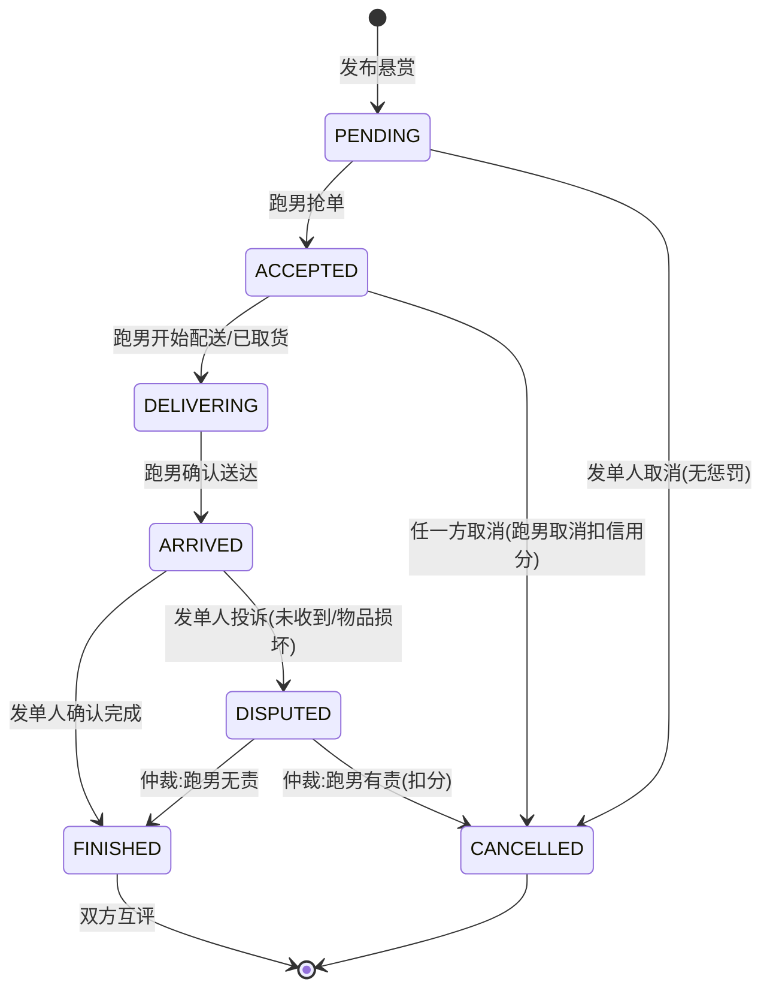

# 校园集市 · 跑腿单状态机与接口设计

> 版本：v1.0　　后端：Spring Boot 3 + MyBatis-Plus　　通信：RESTful API + JSON

---

## 1. 状态机定义

### 1.1 状态枚举

| 状态码 | 枚举名 | 含义 | 终止态 |
|---|---|---|---|
| 0 | PENDING | 待接单 | 否 |
| 1 | ACCEPTED | 已接单（跑男已抢，待取货） | 否 |
| 2 | DELIVERING | 配送中 | 否 |
| 3 | ARRIVED | 送达待确认（跑男点了送达，等发单人确认） | 否 |
| 4 | FINISHED | 已完成 | **是** |
| 5 | CANCELLED | 已取消 | **是** |
| 6 | DISPUTED | 申诉中 | 否（仲裁后回到4或5） |

### 1.2 状态流转图



### 1.3 流转规则表（开发直接照此实现）

| 事件 | 操作角色 | 前置状态 | 目标状态 | 校验规则 | 副作用 |
|---|---|---|---|---|---|
| 发布 | 发单人 | — | PENDING | 已认证；金额>0 | 写订单 |
| 抢单 | 跑男 | PENDING | ACCEPTED | 已认证+跑男资格；不能接自己发的单；进行中接单数<3 | 记录 runner_id + accept_time；通知发单人 |
| 开始配送 | 跑男 | ACCEPTED | DELIVERING | 必须是本单接单人 | deliver_time |
| 确认送达 | 跑男 | DELIVERING | ARRIVED | 必须是本单接单人 | arrive_time；取件码此后对跑男隐藏 |
| 确认完成 | 发单人 | ARRIVED | FINISHED | 必须是本单发单人 | finish_time；双方信用分+2；触发评价 |
| 取消(待接单) | 发单人 | PENDING | CANCELLED | 必须是本单发单人 | 无惩罚 |
| 取消(已接单) | 发单人 | ACCEPTED | CANCELLED | 必须是本单发单人 | 通知跑男 |
| 取消(已接单) | 跑男 | ACCEPTED | CANCELLED | 必须是本单接单人 | **跑男信用分-10**（爽约惩罚） |
| 申诉 | 发单人 | ARRIVED | DISPUTED | 必须是本单发单人 | 写投诉单，进入仲裁队列 |
| 仲裁 | 管理员 | DISPUTED | FINISHED / CANCELLED | 后台操作 | 有责方扣分、写信用流水 |

> **设计红线**：配送中（DELIVERING）之后不允许任何一方单方面取消——货已在路上，取消必须走申诉仲裁。这条规则在答辩时主动讲，体现业务思考的严谨性。

---

## 2. 接口清单（RESTful）

统一约定：
- Base URL：`/api`
- 认证：请求头 `Authorization: Bearer {token}`（JWT）
- 统一响应体：`{ "code": 200, "msg": "success", "data": {...} }`，非 200 即业务错误
- 幂等：所有状态推进类接口重复调用返回相同结果，不报错不重复扣分

| 方法 | 路径 | 说明 | 角色 |
|---|---|---|---|
| POST | /errand/publish | 发布跑腿单 | 已认证用户 |
| GET | /errand/hall?type=&sort=&page= | 接单大厅（status=0 的分页列表） | 跑男 |
| GET | /errand/{id} | 订单详情（按角色和状态脱敏） | 相关方 |
| POST | /errand/{id}/accept | 抢单 | 跑男 |
| POST | /errand/{id}/deliver | 开始配送 | 本单跑男 |
| POST | /errand/{id}/arrive | 确认送达 | 本单跑男 |
| POST | /errand/{id}/confirm | 确认完成 | 本单发单人 |
| POST | /errand/{id}/cancel | 取消订单（body 带原因） | 双方（按状态校验） |
| POST | /errand/{id}/dispute | 发起申诉 | 本单发单人 |
| GET | /errand/my/publish?status= | 我发布的单 | 发单人 |
| GET | /errand/my/accept?status= | 我接的单 | 跑男 |

**详情接口脱敏规则（服务端实现，不靠前端隐藏）**：

| 查看者 | pickup_code 取件码 | 双方联系方式 |
|---|---|---|
| 路人（非跑男接单前） | 不返回 | 不返回 |
| 发单人 | 始终可见（自己的） | 接单后可见跑男信息 |
| 本单跑男 | 仅 ACCEPTED/DELIVERING 状态可见 | 接单后可见发单人信息 |
| 其他人/订单结束后 | 不返回 | 不返回 |

---

## 3. 后端核心代码

### 3.1 状态枚举 + 流转合法性表（ErrandStatusEnum.java）

```java
@Getter
@AllArgsConstructor
public enum ErrandStatusEnum {
    PENDING(0, "待接单"),
    ACCEPTED(1, "已接单"),
    DELIVERING(2, "配送中"),
    ARRIVED(3, "送达待确认"),
    FINISHED(4, "已完成"),
    CANCELLED(5, "已取消"),
    DISPUTED(6, "申诉中");

    private final int code;
    private final String desc;

    /** 合法流转表：key=当前状态，value=允许到达的状态集合 */
    private static final Map<ErrandStatusEnum, Set<ErrandStatusEnum>> TRANSITIONS = Map.of(
        PENDING,    EnumSet.of(ACCEPTED, CANCELLED),
        ACCEPTED,   EnumSet.of(DELIVERING, CANCELLED),
        DELIVERING, EnumSet.of(ARRIVED),
        ARRIVED,    EnumSet.of(FINISHED, DISPUTED),
        DISPUTED,   EnumSet.of(FINISHED, CANCELLED),
        FINISHED,   EnumSet.noneOf(ErrandStatusEnum.class),
        CANCELLED,  EnumSet.noneOf(ErrandStatusEnum.class)
    );

    public boolean canTransitTo(ErrandStatusEnum target) {
        return TRANSITIONS.get(this).contains(target);
    }
}
```

> 用一张**显式的流转表**而不是散落在各处的 if-else，是状态机设计的关键——新增状态时只改这一个地方，杜绝"野流转"。

### 3.2 状态推进统一入口（ErrandStateMachine.java）

```java
@Service
@RequiredArgsConstructor
public class ErrandStateMachine {

    private final ErrandOrderMapper orderMapper;
    private final CreditService creditService;
    private final MessageService messageService;

    /**
     * 统一状态推进方法：所有状态变更必须走这里
     * 1. 校验流转合法性   2. 校验操作人身份   3. 乐观锁更新   4. 执行副作用
     */
    @Transactional(rollbackFor = Exception.class)
    public void transit(Long orderId, ErrandStatusEnum target, Long operatorId, String reason) {
        ErrandOrder order = orderMapper.selectById(orderId);
        if (order == null || order.getIsDeleted() == 1) {
            throw new BizException("订单不存在");
        }
        ErrandStatusEnum current = ErrandStatusEnum.values()[order.getStatus()];
        // 幂等：重复请求直接返回，视为成功
        if (current == target) return;
        if (!current.canTransitTo(target)) {
            throw new BizException("当前状态不允许该操作：" + current.getDesc());
        }
        checkPermission(order, target, operatorId);   // 身份校验，见 3.3
        applySideEffectBefore(order, target, operatorId, reason); // 副作用，见 3.4

        // 乐观锁更新：WHERE status=旧状态 AND version=旧版本，防并发脏写
        int rows = orderMapper.updateStatusWithLock(
                orderId, current.getCode(), target.getCode(), order.getVersion());
        if (rows == 0) {
            throw new BizException("手慢了，订单状态已变化，请刷新");
        }
        messageService.pushStatusChange(order, target); // 推送状态变更通知
    }
}
```

对应的 Mapper SQL（MyBatis-Plus 自定义 update）：

```java
@Update("UPDATE errand_order SET status = #{target}, version = version + 1, " +
        "update_time = NOW() WHERE id = #{id} AND status = #{current} AND version = #{version}")
int updateStatusWithLock(@Param("id") Long id, @Param("current") int current,
                         @Param("target") int target, @Param("version") int version);
```

### 3.3 权限校验（谁能在什么状态干什么事）

```java
private void checkPermission(ErrandOrder order, ErrandStatusEnum target, Long operatorId) {
    boolean isPublisher = order.getPublisherId().equals(operatorId);
    boolean isRunner    = operatorId.equals(order.getRunnerId());
    switch (target) {
        case ACCEPTED:   // 抢单：跑男身份在 Controller 层已校验，这里防"自己接自己的单"
            if (isPublisher) throw new BizException("不能接自己发布的单");
            break;
        case DELIVERING:
        case ARRIVED:
            if (!isRunner) throw new BizException("只有本单接单人可以操作");
            break;
        case FINISHED:
        case DISPUTED:
            if (!isPublisher) throw new BizException("只有本单发单人可以操作");
            break;
        case CANCELLED:
            if (!isPublisher && !isRunner) throw new BizException("只有订单双方可以取消");
            // 配送中之后禁止单方面取消，流转表已保证到不了这里
            break;
        default:
    }
}
```

### 3.4 副作用（信用分 + 时间戳 + 敏感信息控制）

```java
private void applySideEffectBefore(ErrandOrder order, ErrandStatusEnum target,
                                   Long operatorId, String reason) {
    LocalDateTime now = LocalDateTime.now();
    switch (target) {
        case ACCEPTED:
            // 校验该跑男进行中的单不超过 3 单，防囤单
            int doing = orderMapper.countDoingByRunner(operatorId);
            if (doing >= 3) throw new BizException("你手头的单太多了，先完成再接");
            order.setRunnerId(operatorId);
            order.setAcceptTime(now);
            break;
        case DELIVERING: order.setDeliverTime(now); break;
        case ARRIVED:    order.setArriveTime(now); break;
        case FINISHED:
            order.setFinishTime(now);
            creditService.change(order.getPublisherId(), +2, "跑腿订单顺利完成", order.getId());
            creditService.change(order.getRunnerId(),    +2, "跑腿订单顺利完成", order.getId());
            break;
        case CANCELLED:
            order.setCancelBy(operatorId);
            order.setCancelReason(reason);
            // 已接单后跑男主动取消 = 爽约，扣 10 分
            if (operatorId.equals(order.getRunnerId())) {
                creditService.change(order.getRunnerId(), -10, "接单后爽约", order.getId());
            }
            break;
        case DISPUTED:
            complaintService.createFromDispute(order, operatorId, reason);
            break;
        default:
    }
}
```

### 3.5 抢单接口（并发安全的正确姿势）

```java
@RestController
@RequestMapping("/api/errand")
@RequiredArgsConstructor
public class ErrandController {

    private final ErrandStateMachine stateMachine;
    private final ErrandOrderMapper orderMapper;

    /** 抢单：CAS 更新，数据库层面保证只有一个赢家 */
    @PostMapping("/{id}/accept")
    public Result<Void> accept(@PathVariable Long id, @RequestAttribute Long userId) {
        // 前置校验：跑男资格、认证状态（拦截器已做）
        ErrandOrder order = orderMapper.selectById(id);
        if (order.getPublisherId().equals(userId)) throw new BizException("不能接自己发布的单");

        // 原子抢单：只有 status 仍是 0 才能更新成功
        int rows = orderMapper.acceptOrder(id, userId);
        if (rows == 0) throw new BizException("手慢了，这单刚被抢走");
        return Result.ok();
    }
}
```

```java
@Update("UPDATE errand_order SET runner_id = #{runnerId}, status = 1, accept_time = NOW(), " +
        "version = version + 1 WHERE id = #{id} AND status = 0")
int acceptOrder(@Param("id") Long id, @Param("runnerId") Long runnerId);
```

> **为什么不能"先查后改"**：两个跑男同时抢单时，先 SELECT 判断 status=0 再 UPDATE，中间存在时间窗口，会造成一单两人接。`UPDATE ... WHERE status=0` 是单条原子语句，MySQL 行锁保证只有一个成功——这是本项目并发设计的核心考点。

### 3.6 信用分服务（只允许走流水）

```java
@Service
@RequiredArgsConstructor
public class CreditService {

    private final CreditLogMapper creditLogMapper;
    private final UserMapper userMapper;

    @Transactional(rollbackFor = Exception.class)
    public void change(Long userId, int delta, String reason, Long orderId) {
        // 先扣/加分（带下限保护），再写流水，两步同一事务
        int rows = userMapper.changeCredit(userId, delta);
        if (rows == 0) throw new BizException("信用分更新失败");

        User user = userMapper.selectById(userId);
        creditLogMapper.insert(new CreditLog(userId, delta, user.getCreditScore(),
                reason, 2, orderId, null));

        // 低于 60 分：后续发布/接单由全局拦截器统一拦截
    }
}
```

```java
@Update("UPDATE user SET credit_score = GREATEST(0, LEAST(100, credit_score + #{delta})), " +
        "update_time = NOW() WHERE id = #{userId}")
int changeCredit(@Param("userId") Long userId, @Param("delta") int delta);
```

---

## 4. 异常与边界场景处理清单

| 场景 | 处理策略 |
|---|---|
| 两人同时抢同一单 | UPDATE 原子 CAS，后到者收到"手慢了" |
| 跑男接单后失联 | 发单人可在 ACCEPTED 状态取消并投诉，跑男扣分 |
| 跑男点了送达但发单人说没收到 | 发单人发起申诉 → 仲裁看聊天记录/照片证据裁决 |
| 发单人不点"确认完成" | ARRIVED 满 24 小时自动确认完成（定时任务），并照常给跑男加分 |
| 订单超时无人接 | PENDING 超过期望时间 2 小时，系统推送询问发单人是否加价或取消 |
| 重复点击按钮 | 状态机幂等：current == target 直接返回成功 |
| 取件码泄露风险 | 仅在 1、2 状态返回给跑男；到 3 状态起接口不再返回该字段 |

---

## 5. 补充接口清单（用户 / 闲置 / 基础数据 / 消息 / 售后）

> 与第 2 节同一套约定：Base URL `/api`、JWT、统一响应体、幂等。
> 本表覆盖前端骨架 `api/` 目录全部 8 个模块，后端按此实现即可对齐。

### 5.1 用户与认证

| 方法 | 路径 | 说明 |
|---|---|---|
| POST | /user/login | 手机号密码登录，返回 token + userInfo |
| POST | /user/register | 注册（phone/smsCode/password/nickname） |
| POST | /user/sms | 发送短信验证码 |
| GET | /user/info | 当前用户信息 |
| POST | /user/auth | 提交校园认证（type=1 普通认证 / 2 跑男认证） |
| GET | /user/credit/logs?page= | 信用分流水（分页） |

### 5.2 闲置商品与订单

| 方法 | 路径 | 说明 |
|---|---|---|
| GET | /goods/list?categoryId=&keyword=&page= | 商品列表（分类筛选 + 关键词搜索） |
| GET | /goods/{id} | 商品详情（服务端累计 view_count） |
| POST | /goods/publish | 发布商品 |
| GET | /goods/my?status=&page= | 我的发布 |
| POST | /goods/{id}/offshelf ・ /onshelf | 下架 / 重新上架 |
| POST | /goods/{id}/favorite | 收藏 / 取消收藏（切换式，返回最新状态） |
| GET | /goods/favorite/my?page= | 我的收藏 |
| POST | /goods/order/create | 立即交易：校验商品在售 → 生成订单（金额快照）→ 锁定商品，同一事务 |
| GET | /goods/order/my?role=buyer\|seller&page= | 我的闲置订单 |
| POST | /goods/order/{id}/finish | 确认完成面交 |
| POST | /goods/order/{id}/cancel | 取消订单（body 带原因） |

### 5.3 基础数据与文件

| 方法 | 路径 | 说明 |
|---|---|---|
| GET | /category/list?type= | 分类列表（type=1 闲置 / 2 跑腿，不传返回全部启用） |
| GET | /location/list | 校内地点库（预置数据，只读） |
| GET | /notice/list | 系统公告（status=1） |
| POST | /file/upload | 图片上传（multipart，字段名 file），返回可访问 URL |

### 5.4 聊天消息

| 方法 | 路径 | 说明 |
|---|---|---|
| GET | /message/sessions | 会话列表：按最后消息时间倒序，含未读数 |
| GET | /message/history?userId=&page= | 与某人的聊天记录（时间倒序分页） |
| POST | /message/send | 发送消息（toUserId/content/type/goodsId） |
| POST | /message/read | 将与某人的会话标记已读 |
| GET | /message/unread/count | 全局未读数（Tab 角标） |

### 5.5 评价与投诉

| 方法 | 路径 | 说明 |
|---|---|---|
| POST | /evaluate/submit | 提交评价；每单每人限一次（uk_order_from 唯一约束，重复提交按幂等返回成功） |
| GET | /evaluate/user/{userId}?page= | 某用户收到的评价 |
| GET | /evaluate/my?page= | 我发出的评价 |
| POST | /complaint/submit | 提交投诉（orderType/orderId/defendantId/type/content/evidence） |
| GET | /complaint/my | 我的投诉记录（发起 + 被投诉） |
| GET | /complaint/{id} | 投诉详情（处理进度与结果） |
